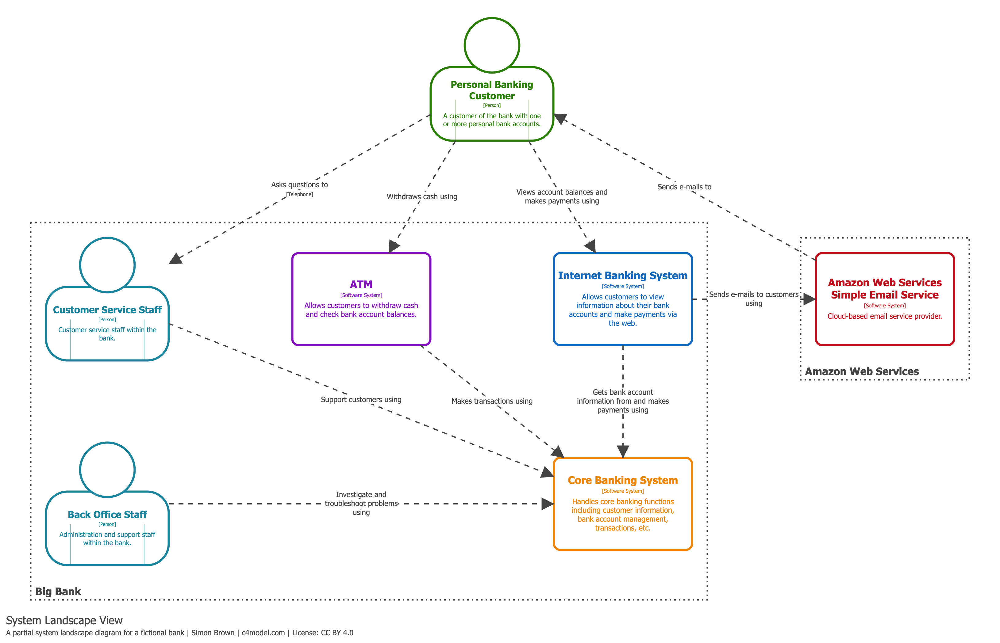

# Diagrama System Landscape

## Propósito

Mostrar cómo múltiples sistemas de software se interconectan dentro de una empresa u organización. Los sistemas de software nunca existen de forma aislada, y este diagrama proporciona el contexto general de todo el ecosistema.

Funciona como un diagrama de contexto de sistema (*System Context*) pero sin centrarse en un único sistema: es un mapa completo de todos los sistemas y sus relaciones.

## Alcance

Una empresa, organización, departamento o límite institucional similar.

## Elementos principales

- **Personas** (usuarios, actores, roles, personas).
- **Sistemas de software** relevantes dentro del alcance organizacional elegido.

## Audiencia prevista

Tanto personas técnicas como no técnicas, dentro y fuera del equipo de desarrollo. Es especialmente valioso para organizaciones grandes que gestionan múltiples sistemas de software.

## ¿Recomendado?

**Sí**, especialmente para organizaciones grandes que necesitan comprender su portafolio completo de sistemas y sus interdependencias.

## Ejemplo práctico

El siguiente diagrama muestra un ejemplo de System Landscape para un sistema bancario ficticio (*Big Bank plc*):

En este ejemplo se observa:
- Los distintos sistemas de software de la organización (Internet Banking, ATM, etc.).
- Los usuarios y actores que interactúan con ellos.
- Los sistemas externos de los que dependen.
- Las relaciones y flujos de datos entre todos los elementos.

## Referencias

- [System Landscape Diagram — c4model.com](https://c4model.com/diagrams/system-landscape)
