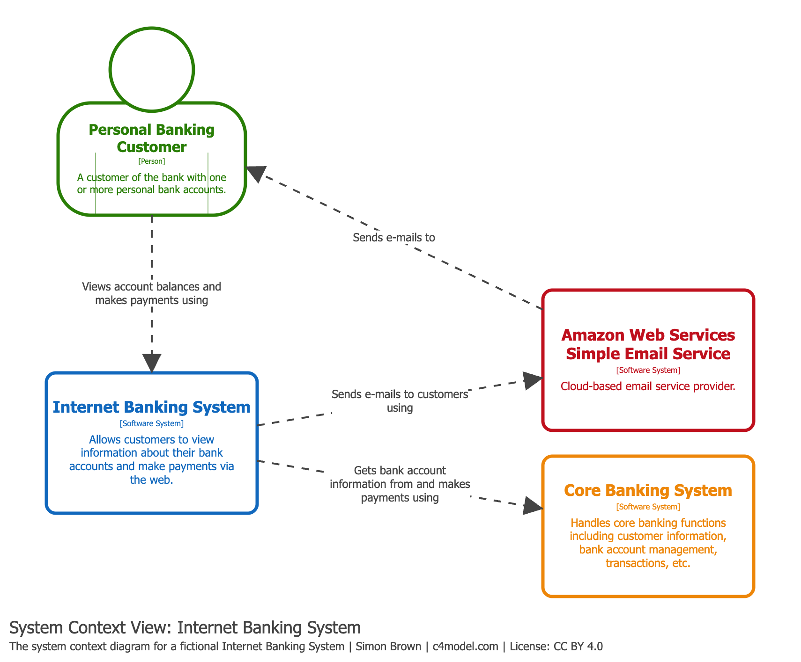

# Diagrama System Context

## Propósito

Es el punto de partida ideal para documentar un sistema de software. Permite dar un paso atrás y ver el panorama general: el sistema en el centro, rodeado de sus usuarios y de los sistemas externos con los que interactúa.

Se enfoca en **personas y sistemas de software**, no en tecnologías, protocolos u otros detalles de bajo nivel. El detalle se minimiza deliberadamente para mayor claridad.

## Alcance

Un único sistema de software.

## Elementos principales

El sistema de software en cuestión (el que estamos documentando).

## Elementos de soporte

- **Personas** (actores, roles, personas) que usan el sistema.
- **Sistemas de software externos** que se conectan directamente al sistema. Estos típicamente están fuera de tu propiedad o responsabilidad.

## Audiencia prevista

**Todos** — tanto personas técnicas como no técnicas, incluyendo aquellas fuera del equipo de desarrollo. Es apropiado para presentar a audiencias no técnicas.

## ¿Recomendado?

**Sí.** Un diagrama de contexto de sistema está recomendado para todos los equipos de desarrollo de software.

## Ejemplo práctico

El siguiente diagrama muestra el contexto del sistema *Internet Banking System* de Big Bank plc:

En este ejemplo se observa:
- El sistema central (*Internet Banking System*) en el medio.
- El *Personal Banking Customer* como usuario principal.
- El *E-mail System* y el *Mainframe Banking System* como sistemas externos con los que interactúa.

## Referencias

- [System Context Diagram — c4model.com](https://c4model.com/diagrams/system-context)
