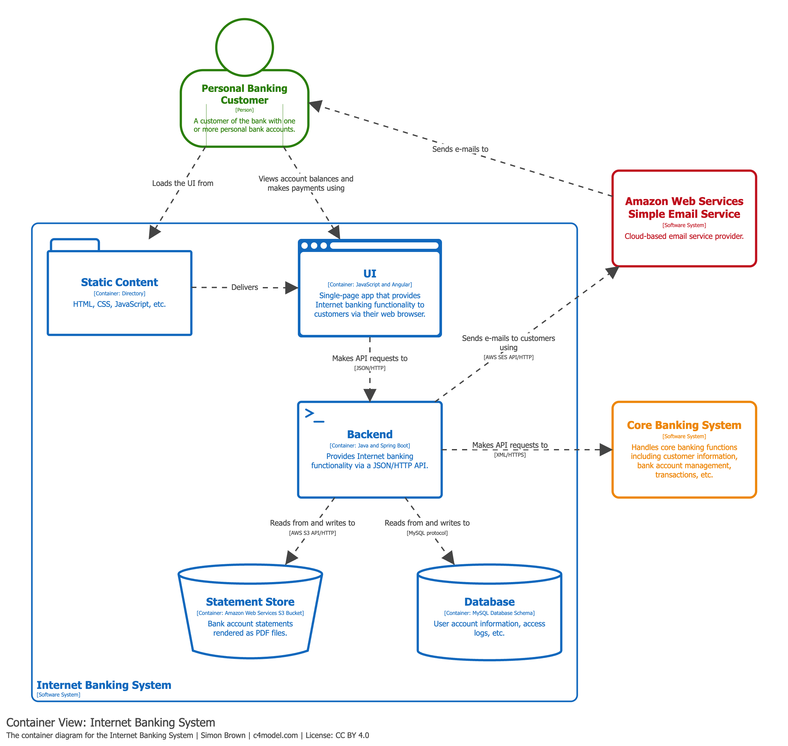

# Diagrama de Contenedores (Container Diagram)

## Propósito

Una vez que se entiende cómo encaja el sistema en el entorno general de TI, el siguiente paso es hacer zoom dentro del límite del sistema. El diagrama de contenedores muestra:

- La **forma arquitectónica de alto nivel** del sistema.
- Cómo se **distribuyen las responsabilidades** entre los contenedores.
- Las **principales decisiones tecnológicas** adoptadas.
- Cómo se **comunican los contenedores** entre sí.

## Alcance

Un único sistema de software.

## Elementos principales

**Contenedores** dentro del sistema de software: aplicaciones o almacenes de datos como aplicaciones web, aplicaciones móviles, bases de datos, sistemas de archivos o buckets de almacenamiento en la nube.

## Elementos de soporte

- Personas que se conectan directamente a los contenedores.
- Sistemas de software externos que se conectan a los contenedores.

## Audiencia prevista

Personal técnico: arquitectos de software, desarrolladores y personal de operaciones/soporte, tanto dentro como fuera del equipo de desarrollo.

## ¿Recomendado?

**Sí.** Un diagrama de contenedores está recomendado para todos los equipos de desarrollo de software.

## Nota importante

Este diagrama **omite detalles de despliegue** (clustering, balanceadores de carga, replicación, failover), ya que estos varían entre entornos. Los [diagramas de despliegue](07-deployment-diagram.md) capturan esa información.

## Ejemplo práctico

El siguiente diagrama muestra los contenedores del *Internet Banking System*:

En este ejemplo se observa:
- La **Single-Page Application** y la **Mobile App** como front-ends.
- La **API Application** como backend central.
- La **Database** como almacén de datos.
- Las conexiones con sistemas externos (E-mail System, Mainframe Banking System).
- Las tecnologías utilizadas en cada contenedor.

## Referencias

- [Container Diagram — c4model.com](https://c4model.com/diagrams/container)
