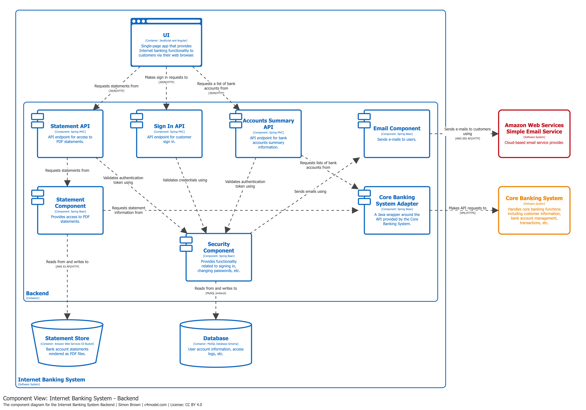

# Diagrama de Componentes (Component Diagram)

## Propósito

Permite hacer zoom dentro de un contenedor individual para visualizar su estructura interna: los componentes que lo conforman, sus responsabilidades y los detalles de tecnología/implementación.

## Alcance

Un único contenedor dentro de un sistema de software.

## Elementos principales

**Componentes** alojados dentro del contenedor que se está analizando.

## Elementos de soporte

- Otros contenedores del mismo sistema de software.
- Personas y sistemas de software externos que interactúan con los componentes.

## Audiencia prevista

Arquitectos de software y desarrolladores que necesitan comprender la arquitectura interna de un contenedor.

## ¿Recomendado?

**No de forma generalizada.** Solo se deben crear diagramas de componentes si aportan valor real. Considera automatizar su creación para documentación de larga duración.

> *"Only create component diagrams if you feel they add value, and consider automating their creation for long-lived documentation."*

## Ejemplo práctico

El siguiente diagrama muestra los componentes internos de la *API Application* del Internet Banking System:

En este ejemplo se observa:
- Los componentes internos de la API Application (Sign In Controller, Accounts Summary Controller, Security Component, etc.).
- Cómo cada componente se conecta con otros contenedores (Database) y sistemas externos (Mainframe Banking System, E-mail System).
- Las tecnologías de implementación de cada componente (Spring MVC, Spring Bean, etc.).

## Referencias

- [Component Diagram — c4model.com](https://c4model.com/diagrams/component)
