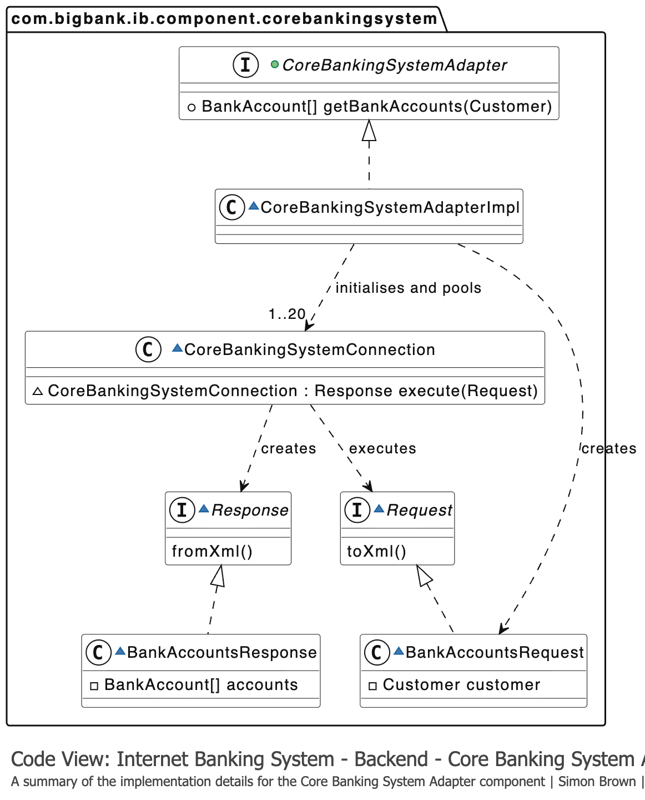

# Diagrama de Código (Code Diagram)

## Propósito

Representa el nivel más profundo de detalle arquitectónico en el modelo C4. Hace zoom dentro de un componente para ilustrar su implementación mediante diagramas de clases UML, diagramas de entidad-relación u otras visualizaciones a nivel de código.

## Alcance

Un único componente.

## Elementos principales

**Elementos de código**: clases, interfaces, objetos, funciones, tablas de base de datos, etc.

## Audiencia prevista

Arquitectos de software y desarrolladores.

## ¿Recomendado?

**No.** Especialmente para documentación de larga duración, ya que la mayoría de los IDEs pueden generar estos diagramas automáticamente bajo demanda, haciendo que los diagramas estáticos sean poco prácticos de mantener.

> Solo muestra los atributos y métodos necesarios para comunicar tu narrativa. Funciona mejor para componentes particularmente críticos o complejos.

## Ejemplo práctico

El siguiente diagrama muestra la estructura a nivel de código del componente *MainframeBankingSystemFacade*:

En este ejemplo se observa:
- Las clases e interfaces que componen el componente.
- Las relaciones de herencia e implementación.
- Los atributos y métodos relevantes para entender el diseño.

## Referencias

- [Code Diagram — c4model.com](https://c4model.com/diagrams/code)
