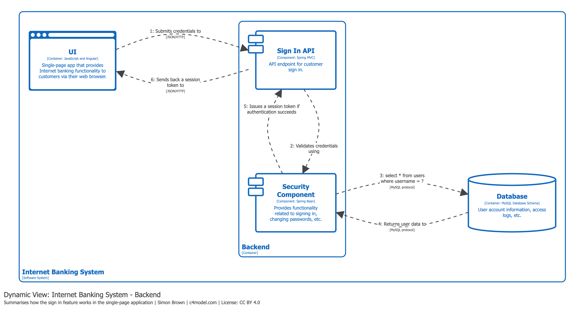

# Diagrama Dinámico (Dynamic Diagram)

## Propósito

Mostrar cómo los elementos del modelo estático **colaboran en tiempo de ejecución** para implementar una historia de usuario, caso de uso, funcionalidad, etc. Está basado en diagramas de comunicación UML, con interacciones numeradas que indican el orden de ejecución.

## Alcance

Una funcionalidad, historia de usuario, caso de uso o contexto delimitado particular.

## Elementos principales y de soporte

Existe flexibilidad para mostrar **sistemas de software, contenedores o componentes** que participan en las interacciones en tiempo de ejecución. No hay restricción de nivel fijo.

## Audiencia prevista

Tanto personas técnicas como no técnicas, incluyendo aquellas fuera del equipo de desarrollo.

## ¿Recomendado?

**No de forma general.** Deben usarse con moderación, reservándolos para demostrar patrones interesantes o recurrentes y funcionalidades que involucran secuencias de interacción complejas.

> *"Should be used sparingly rather than as standard documentation components."*

## Estilos de presentación

Existen dos estilos que transmiten la misma información:

1. **Estilo colaboración** — similar a diagramas de comunicación UML, con disposición libre de elementos.
2. **Estilo secuencia** — similar a diagramas de secuencia UML.

## Ejemplo práctico

El siguiente diagrama muestra un ejemplo de diagrama dinámico en estilo colaboración para el flujo de inicio de sesión:

En este ejemplo se observa:
- Los elementos que participan en el flujo (usuario, contenedores, componentes).
- Las interacciones numeradas que indican el orden de ejecución.
- La dirección del flujo de datos entre los participantes.

## Referencias

- [Dynamic Diagram — c4model.com](https://c4model.com/diagrams/dynamic)
