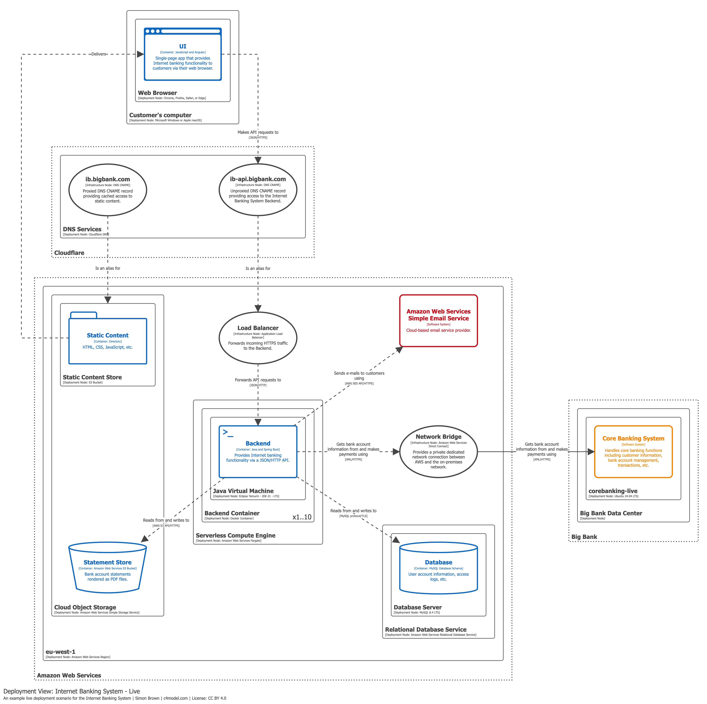

# Diagrama de Despliegue (Deployment Diagram)

## Propósito

Ilustrar cómo las instancias de sistemas de software y/o contenedores del modelo estático se despliegan sobre la infraestructura dentro de un **entorno de despliegue** determinado (por ejemplo, producción, staging, desarrollo).

## Alcance

Uno o más sistemas de software dentro de un único entorno de despliegue.

## Elementos principales

- **Nodos de despliegue** (*deployment nodes*).
- **Instancias de sistemas de software**.
- **Instancias de contenedores**.

## Elementos de soporte

Nodos de infraestructura como servicios DNS, balanceadores de carga y firewalls utilizados en el despliegue del sistema.

## Tipos de nodos de despliegue

Un nodo de despliegue representa dónde se ejecutan las instancias de sistemas o contenedores:

| Tipo | Ejemplos |
|------|----------|
| Infraestructura física | Servidores, dispositivos |
| Infraestructura virtualizada | IaaS, PaaS, máquinas virtuales |
| Infraestructura contenerizada | Docker |
| Entornos de ejecución | Servidores de base de datos, servidores de aplicaciones |

Los nodos de despliegue **pueden anidarse** unos dentro de otros.

## Audiencia prevista

Personal técnico: arquitectos de software, desarrolladores, arquitectos de infraestructura y personal de operaciones/soporte, tanto dentro como fuera del equipo de desarrollo.

## ¿Recomendado?

**Sí.**

## Nota sobre iconos

Se recomienda usar iconos de proveedores de nube (AWS, Azure, GCP, etc.) siempre que se incluyan en la leyenda del diagrama. Los diagramas están basados en diagramas de despliegue UML.

## Ejemplo práctico

El siguiente diagrama muestra el despliegue en producción (*Live*) del Internet Banking System:

En este ejemplo se observa:
- La infraestructura de producción con sus nodos (servidores web, servidores de aplicaciones, servidores de base de datos).
- Las instancias de contenedores desplegadas en cada nodo.
- Los elementos de infraestructura de soporte (balanceadores de carga, firewalls).
- Las relaciones y protocolos de comunicación entre nodos.

## Referencias

- [Deployment Diagram — c4model.com](https://c4model.com/diagrams/deployment)
